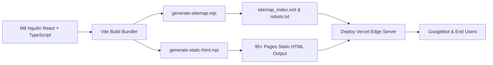

<div align="center">

  

  <h1>K-Home Đồng Nai · Portal Web Nhà Ở Xã Hội</h1>

  <p>
    <b>Nền tảng truyền thông & đăng ký mua Nhà Ở Xã Hội Kim Oanh Group tại Đồng Nai</b><br />
    <i>SEO Tối Ưu Tốc Độ · Static Pre-rendering 95+ Pages · Chuẩn Dữ Liệu Cấu Trúc Schema JSON-LD</i>
  </p>

  <p>
    <a href="https://nodejs.org"></a>
    <a href="https://www.typescriptlang.org"></a>
    <a href="https://react.dev"></a>
    <a href="https://vitejs.dev"></a>
    <a href="https://vercel.com"></a>
    <a href="./LICENSE"></a>
  </p>

  <p>
    🌐 <b>Website chính thức:</b> <a href="https://k-homedongnai.com.vn">k-homedongnai.com.vn</a>
  </p>

  <p>
    <a href="#-quick-start">Quick Start</a> •
    <a href="#-dự-án-trọng-điểm">Projects</a> •
    <a href="#-tính-năng-seo-nổi-bật">SEO Engine</a> •
    <a href="#-cấu-trúc-thư-mục">Structure</a> •
    <a href="#-license">License</a>
  </p>

  <br />

</div>

---

## 🛠️ Quy Trình Hoạt Động & Kiến Trúc (Architecture Flow)



---

## 📌 Danh Mục Sản Phẩm & Dự Án Trọng Điểm

| Dự Án | Vị Trí | Quy Mô | Loại Căn | Giá Khởi Điểm |
| :--- | :--- | :--- | :--- | :--- |
| **K-Home CityView** | Đường Điểu Xiển, P. Hố Nai, TP. Biên Hòa | 2,85 ha · 4 Block 22 Tầng (1.328 căn) | 1PN+A, 1PN+B, 2PN, 3PN | Từ 950 Triệu |
| **K-Home Midtown** | Giao 4 tuyến đường trung tâm Trảng Bom | 13,97 ha · 1 Block 15 Tầng (542 căn) | Studio, 1PN+A, 1PN+B, 2PN | Từ 750 Triệu |
| **K-Home Avenue** | Đường Nguyễn Ái Quốc (25C), Xã Nhơn Trạch | 5,3 ha · 4 Block 12 Tầng (1.022 căn) | Studio, 1PN+, 2PN Nhỏ, 2PN Lớn | Từ 750 Triệu |

---

## 🚀 Tính Năng Kỹ Thuật & Tối Ưu SEO

- ⚡ **Static Pre-Rendering (SSG)**: Tự động biên dịch 95+ trang HTML tĩnh (`dist/**/*.html`) giúp Googlebot cào nội dung siêu nhanh mà không bị lỗi JavaScript Client-side.
- 🎯 **Dữ Liệu Dự Phòng (Offline Static Fallback)**: Tích hợp `STATIC_PROJECTS` bảo vệ trang web 100% không bao giờ bị dính lỗi 404 trang trống.
- 🏷️ **Schema Dữ Liệu Cấu Trúc (JSON-LD)**: 
  - `RealEstateListing` cho trang chi tiết dự án.
  - `BreadcrumbList` 3 cấp cho bài tin tức & dự án.
  - `FAQPage` hiển thị kết quả hỏi đáp nâng cao trên Google Search.
- 🗺️ **Sitemap Index Tự Động**: Phân tách sitemap tĩnh (`page-sitemap.xml`) và bài tin tức (`post-sitemap.xml`) tự động cập nhật mỗi khi build.
- 🔒 **Chống Lỗi Robots.txt**: Mở quyền cho Googlebot cào API công khai (`Allow: /api/projects`, `Allow: /api/news`).

---

## 💻 Cấu Trúc Thư Mục Dự Án (Project Structure)

```text
k-home-cityview/
├── api/                  # Serverless API Endpoints (projects.ts, news.ts)
├── public/               # Tài nguyên tĩnh (Hình ảnh, PDF, robots.txt, sitemap)
│   ├── news/             # Slide presentation PDF & Ảnh bài viết
│   ├── k-home cityview/  # Bộ ảnh phối cảnh K-Home CityView
│   ├── k-home midtown/   # Bộ ảnh phối cảnh K-Home Midtown
│   └── k-home avenue/    # Bộ ảnh phối cảnh K-Home Avenue
├── scripts/              # Build scripts (Sitemap & Static HTML Pre-renderer)
│   ├── generate-sitemap.mjs
│   └── generate-static-html.mjs
├── src/
│   ├── components/       # UI Components (ProjectDetail, NewsDetail, Contact...)
│   ├── data/             # Dữ liệu static bài viết & fallback dự án (newsData, staticProjects)
│   ├── types.ts          # TypeScript Definitions
│   └── utils/            # Helper functions (Image optimization, formatters)
├── vercel.json           # Cấu hình 301 Redirects & Serverless Headers
└── README.md             # Tài liệu dự án
```

---

## ⚡ Quick Start & Hướng Dẫn Chạy Dự Án

### 1. Cài đặt phụ thuộc (Dependencies)
```bash
npm install
```

### 2. Chạy môi trường Dev (Development)
```bash
npm run dev
```

### 3. Biên dịch Production & Tạo Static HTML
```bash
npm run build
```

### 4. Xem trước bản Build Production
```bash
npm run preview
```

---

## 📄 License

Dự án được phân phối dưới giấy phép **MIT License**. Xem chi tiết tại file [LICENSE](./LICENSE).

<div align="center">
  <sub>Bản quyền thuộc về Kim Oanh Group & K-Home Đồng Nai · 2026</sub>
</div>
